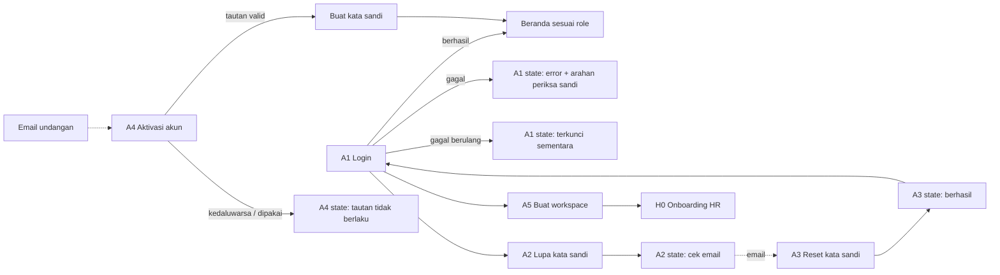
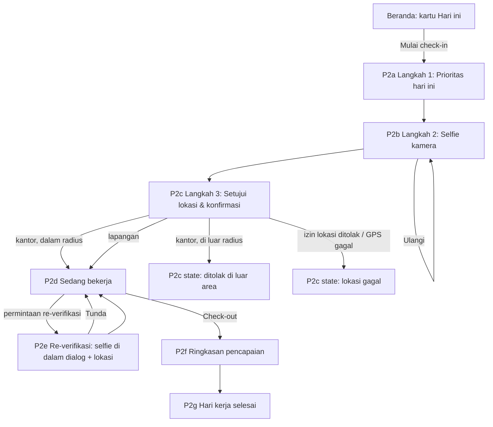
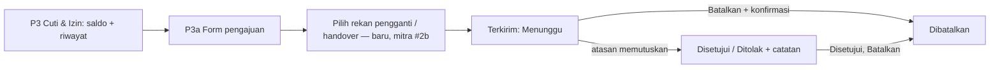
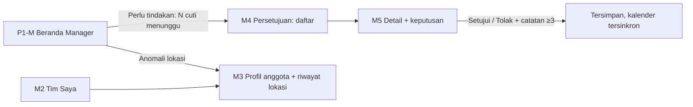
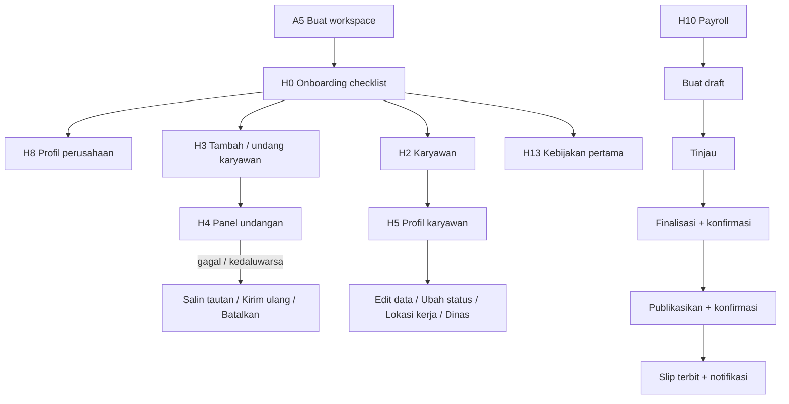

# Revamp Teamku: Flow per Role (Auth → Selesai)

- Tanggal: 29 September 2026
- Sumber: `tmp/Teamku User Guide_V1.docx` (PM) + `tmp/docs-revisi-teamku.xlsx` (mitra) + audit kode `origin/main`
- Dokumen pendamping: [`2026-09-29-user-guide-gap-analysis.md`](./2026-09-29-user-guide-gap-analysis.md)
- Baseline kode: `origin/main` (`d76cad8`). Revamp dimulai dari awal.

Kode layar: `A` = auth, `S` = shell, `P` = personal (semua role), `M` = manager, `H` = HR Admin. Label **[baru]** = belum ada di UI `main` (dari permintaan mitra atau backend yang belum punya UI).

---

## 1. Prinsip redesign

1. **Satu aplikasi, tiga lapisan.** Semua role memakai lapisan **Saya** (presensi, cuti, Ask Teamku, slip). Manager menambah lapisan **Tim**. HR Admin menambah lapisan **Perusahaan**. Navigasi dikelompokkan sesuai lapisan ini, bukan "Workspace / Operations".
2. **Employee = mobile-first.** Presensi terjadi di HP. Layar Employee didesain 390 px dulu, lalu desktop.
3. **Manager & HR = desktop-first**, tetap bisa dipakai di HP untuk persetujuan cepat.
4. **Satu tindakan utama per layar.** Beranda selalu menjawab "apa yang harus saya lakukan sekarang?".
5. **Setiap layar punya state lengkap:** loading, kosong, error, sukses, tidak berwenang.
6. **Bahasa Indonesia penuh**, istilah konsisten: "Pekerja lapangan" (bukan remote/sales), "Cuti & Izin" (bukan Agenda & Cuti).

---

## 2. Matriks akses (dari guide, dipakai sebagai aturan desain)

| Fitur | Employee | Manager | HR Admin |
|---|---|---|---|
| Beranda | Pribadi | Pribadi + departemen | Pribadi + perusahaan |
| Presensi, Cuti & Izin, Ask Teamku, Slip gaji | Diri sendiri | Diri sendiri | Diri sendiri |
| Direktori & profil karyawan | – | Departemen (tanpa gaji) | Semua (dengan gaji) |
| Riwayat lokasi | – | Departemen | Semua |
| Persetujuan cuti | – | Departemen, bukan milik sendiri | Semua, bukan milik sendiri |
| Payroll | – | – | Ya |
| Pengaturan & Kebijakan | – | – | Ya |

Navigasi baru per role:

| Role | Saya | Tim | Perusahaan |
|---|---|---|---|
| Employee | Beranda, Presensi, Cuti & Izin, Slip Gaji, Ask Teamku | – | – |
| Manager | sama | Tim Saya, Persetujuan | – |
| HR Admin | sama | Karyawan, Persetujuan | Payroll, Kebijakan, Pengaturan |

Tab bar mobile: **Beranda · Presensi · Cuti · Lainnya** (Employee). Manager/HR: **Beranda · Presensi · Persetujuan · Lainnya**.

---

## 3. Flow bersama: Autentikasi

| Kode | Layar | Isi utama | State |
|---|---|---|---|
| A1 | Login | Email kerja, kata sandi (show/hide), Masuk, Lupa sandi, Buat workspace | error generik + arahan, terkunci, loading. **Tanpa** akun demo di produksi |
| A2 | Lupa kata sandi | Email kerja, Kirim tautan | "Cek email Anda" (selalu, anti-enumerasi) |
| A3 | Reset kata sandi | Sandi baru + konfirmasi, aturan sandi terlihat [baru] | tautan kedaluwarsa (1 jam), berhasil |
| A4 | Aktivasi undangan | Nama & perusahaan (dari token), buat sandi, aturan sandi [baru] | tautan kedaluwarsa (7 hari) / sudah dipakai |
| A5 | Buat workspace | Nama perusahaan, nama admin, **Email HR resmi** + hint [baru], sandi + aturan [baru] | email sudah dipakai |
| S0 | Workspace gagal dimuat / sesi berakhir | Coba lagi, Kembali ke login | – |

---

## 4. Flow bersama: App shell & personal (semua role)

### 4.1 Shell
| Kode | Layar | Isi |
|---|---|---|
| S1 | Shell desktop | Sidebar 3 grup (Saya/Tim/Perusahaan), nama perusahaan, command palette `⌘K` (menu + karyawan untuk Manager/HR), lonceng, avatar |
| S2 | Shell mobile | Top bar ringkas + tab bar 4 item + sheet "Lainnya" |
| S3 | Menu akun [baru] | Nama, role, departemen, lokasi kerja, **Profil & keamanan**, Keluar. Peringatan jika masih "Sedang bekerja" |
| S4 | Notifikasi | Daftar, belum dibaca, Tandai semua dibaca, klik → halaman terkait |
| S5 | Command palette | Cari menu; Manager/HR juga cari karyawan |
| P7 | Profil & keamanan [baru] | Data diri (read-only), ganti kata sandi (backend `POST /auth/change-password` sudah ada) |

### 4.2 Presensi (inti Employee)

| Kode | Layar | Catatan desain |
|---|---|---|
| P2a | Prioritas hari ini | 1–5 prioritas (API menerima 1–5), minimal 3 karakter |
| P2b | Selfie | Kamera hanya muncul di langkah ini. Galeri tidak dipakai. Label jujur: "bukan face recognition" |
| P2c | Lokasi & konfirmasi | Nama lokasi kerja + radius, persetujuan lokasi, tombol konfirmasi. State: di luar radius, akurasi rendah, izin ditolak |
| P2d | Sedang bekerja | Jam check-in, durasi berjalan, daftar prioritas, status lokasi, tombol Check-out |
| P2e | Re-verifikasi | **Kamera di dalam dialog** (perbaikan bug). Pekerja lapangan: tidak ada re-verifikasi (sesuai API) |
| P2f | Check-out | Ringkasan ≥4 karakter, ambil lokasi |
| P2g | Selesai | Ringkasan hari: check-in, check-out, durasi, prioritas |
| P2h | Perjalanan dinas [baru, mitra #6] | Status "Sedang dinas" + lokasi dinas yang di-set HR → check-in di lokasi dinas. **Butuh backend baru** |

### 4.3 Cuti & Izin

| Kode | Layar | Catatan |
|---|---|---|
| P3 | Cuti & Izin | Saldo (sisa, hak, terpakai), daftar permohonan per status, catatan atasan |
| P3a | Form pengajuan | Tanggal mulai/selesai, dampak saldo (hari kerja), alasan ≥4. State: tanpa hari kerja, tumpang tindih |
| P3b | Handover [baru, mitra #2b] | Pilih rekan pengganti, rekan menyetujui. **Butuh backend baru** |

### 4.4 Ask Teamku, Slip gaji
| Kode | Layar | Catatan |
|---|---|---|
| P4 | Ask Teamku | Input di atas, **jawaban langsung di bawah input**, label Didukung kebijakan / Perlu konfirmasi HR, fakta personal, kartu sumber kebijakan, Hubungi HR (email HR perusahaan). Hapus riwayat palsu & link salah |
| P5 | Slip gaji | Daftar per periode, detail: bruto, potongan, bersih, waktu terbit. State kosong: "HR belum mempublikasikan" |

---

## 5. Role 1 — Employee

**User stories (dari guide):**
1. Melihat status hari kerja → tahu tindakan berikutnya.
2. Check-in dengan bukti (prioritas, selfie, lokasi).
3. Menutup hari dengan ringkasan (check-out).
4. Mengajukan & memantau cuti.
5. Bertanya kebijakan dengan sumber.
6. Melihat slip gaji pribadi.

**Flow penuh:** A4 Aktivasi (atau A1 Login) → P1 Beranda → P2a–P2g Presensi → P3 Cuti → P4 Ask Teamku → P5 Slip → S3 Keluar.

| Kode | Layar | Isi |
|---|---|---|
| P1-E | Beranda Employee | Kartu **Hari ini** (status presensi + 1 tombol aksi utama + prioritas hari ini), saldo cuti, permohonan terakhir, slip terbaru. Banner re-verifikasi bila ada |

**Jumlah layar Employee:** 6 auth + 5 shell + 1 beranda + 8 presensi + 3 cuti + 2 lainnya + 1 profil ≈ **26 layar** (termasuk state penting). Sebagian besar dipakai ulang oleh Manager & HR.

---

## 6. Role 2 — Manager

**User stories (dari guide):**
1. Ringkasan departemen (headcount, hadir, tidak masuk, cuti, telat, agenda).
2. Cari anggota tim → profil.
3. Riwayat lokasi → periksa anomali.
4. Putuskan cuti tim dengan catatan.
5. Tetap memakai fitur personal.

| Kode | Layar | Isi |
|---|---|---|
| P1-M | Beranda Manager | Kartu Hari ini (milik sendiri, ringkas) + **Perlu tindakan** (cuti menunggu dari `pending_approvals`, anomali lokasi) + rekap departemen |
| M2 | Tim Saya | Daftar anggota departemen, cari, status hadir hari ini. **Tanpa kolom gaji** |
| M3 | Profil anggota | Data kerja, lokasi kerja, riwayat lokasi (check-in / re-verifikasi / check-out, jarak, dalam/luar radius, akurasi rendah, re-verifikasi terlewat, Buka di Maps). Read-only |
| M4 | Persetujuan | Tab Menunggu / Disetujui / Ditolak / Semua. Mobile: kartu, bukan tabel |
| M5 | Detail keputusan | Pemohon, tanggal, durasi, alasan, **saldo sisa pemohon**, **siapa lagi yang cuti di tanggal itu**, catatan keputusan. Permohonan milik sendiri: tombol nonaktif + alasan |

"Minta revisi" **tidak** didesain dulu: backend belum punya alur kirim ulang.

---

## 7. Role 3 — HR Admin

**User stories (dari guide + mitra):**
1. Buat workspace → onboarding.
2. Tambah / undang karyawan.
3. Kelola status & lokasi kerja karyawan.
4. Proses cuti semua departemen.
5. Payroll bertahap Draft → Finalized → Published.
6. Atur lokasi, re-verifikasi, pengingat, alert, kalender.
7. Publikasikan kebijakan untuk Ask Teamku.
8. [mitra] Edit data karyawan; status resign/handover; arsip; profil perusahaan; pantau undangan; perjalanan dinas.

| Kode | Layar | Isi |
|---|---|---|
| H0 | Onboarding checklist [baru] | Setelah buat workspace: 1) profil perusahaan 2) lokasi presensi 3) undang karyawan 4) kebijakan pertama. Hilang setelah selesai |
| P1-H | Beranda HR | Kartu Hari ini (milik sendiri) + Perlu tindakan (cuti menunggu, undangan gagal, anomali lokasi, payroll draft) + rekap perusahaan |
| H2 | Karyawan | Tab **Karyawan · Undangan · Arsip**; cari, filter departemen & status; kolom gaji; aksi di menu "⋯" |
| H3 | Tambah karyawan | Nama, email kerja, departemen, jabatan, role, gaji, tipe kerja (kantor + lokasi / lapangan). Aksi: **Undang via email** (utama) / Simpan langsung |
| H4 | Undangan [baru, mitra #4] | Status Terkirim / Perlu kirim manual / Gagal / Diterima / Kedaluwarsa / Dibatalkan; Salin tautan, Kirim ulang, Batalkan |
| H5 | Profil karyawan | Tab **Profil · Kehadiran & lokasi · Akun**. Edit data [baru, mitra #1], ubah status (Aktif, Menuju resign, Handover, Ditangguhkan, Keluar) [baru, mitra #2] + konfirmasi, Arsipkan, lokasi kerja, tipe kerja, **tugaskan dinas** [baru, mitra #6] |
| H6 | Persetujuan | Sama dengan M4/M5, cakupan semua departemen |
| H10 | Payroll | Daftar periode + detail; badge status Indonesia (Draft / Final / Terbit); konfirmasi sebelum Finalisasi & Publikasikan; catatan PPh 21/BPJS manual |
| H8 | Pengaturan · Perusahaan [baru, mitra #3] | Nama perusahaan, email HR resmi, daftar HR Admin (jadikan / cabut) |
| H9 | Pengaturan · Lokasi | Satu / beberapa lokasi, tempel link Maps / pakai lokasi perangkat, radius 50–5000 m (saran 100–300), preview peta |
| H11 | Pengaturan · Re-verifikasi & pengingat | Re-verifikasi (1–3×, jendela menit), pengingat clock-in/out, batas sesi 1–24 jam, salinan ke manager/HR. Catatan: berlaku untuk lokasi utama |
| H12 | Pengaturan · Kalender | Google Calendar (OAuth, pilih kalender), Microsoft 365 "segera hadir", cakupan, mode |
| H13 | Kebijakan | Daftar (Draft / Terbit / Arsip) + editor bagian; konfirmasi publikasi & arsip dengan dialog aplikasi, bukan `confirm()` |
| H14 | Log audit [baru] | Backend `GET /audit-logs` sudah ada. Prioritas rendah |

---

## 8. Ringkasan inventaris layar

| Grup | Layar | Dipakai oleh |
|---|---|---|
| Auth (A1–A5, S0) | 6 | Semua (A5 hanya pendaftar HR) |
| Shell (S1–S5, P7) | 6 | Semua |
| Personal (P1-E, P2a–h, P3–P3b, P4, P5) | 14 | Semua |
| Manager (P1-M, M2–M5) | 5 | Manager (M4/M5 dipakai ulang HR) |
| HR (H0, P1-H, H2–H14) | 13 | HR Admin |
| **Total** | **±44** | |

Butuh backend baru sebelum dibangun: **P2h perjalanan dinas**, **P3b handover cuti**, H5 status lifecycle/edit/arsip, H4 daftar undangan, H8 profil perusahaan (semuanya pernah dibuat di branch lama, bisa dijadikan referensi).

---

## 9. Urutan mockup yang disarankan

**Mulai dari Employee.** Alasannya:
- Layar personal (presensi, cuti, Ask Teamku, slip) dipakai **ketiga role**. Setelah Employee selesai, ±60% layar Manager & HR sudah jadi.
- Presensi adalah fitur paling sering dipakai dan paling banyak bug UX.
- Design system (token + komponen) terbentuk di sini, lalu dipakai ulang.

| Fase | Isi | Layar |
|---|---|---|
| 0 | Design tokens + komponen dasar (tombol, input, badge status, kartu, dialog, tab bar, sidebar) | – |
| 1 | **Employee mobile**: A1, A4, P1-E, P2a–P2g, P3, P3a, P4, P5, S3, S4 | ±16 |
| 2 | Employee desktop: shell S1 + P1-E + presensi + cuti | ±5 |
| 3 | Manager: P1-M, M2–M5 (desktop + mobile untuk persetujuan) | ±6 |
| 4 | HR: A5, H0, P1-H, H2–H13 | ±14 |
| 5 | Fitur baru mitra: P2h dinas, P3b handover | ±3 |

---

## 10. Progres mockup (`mockups/design.pen`)

Fase 0 + Fase 1 selesai (29 Sep 2026).

| Area | Frame di kanvas |
|---|---|
| Design system | `00 · Design System` — token warna, tipografi Plus Jakarta Sans, komponen: StatusBar, Button/Primary, Button/Secondary, Badge, Field, TabBar, AppBar |
| Auth | A1 Login (+ state error), A4 Aktivasi akun (+ aturan sandi) |
| Beranda | P1-E Beranda (belum check-in) |
| Presensi | P2a Prioritas, P2b Selfie, P2c Lokasi & konfirmasi, P2c-err Di luar radius, P2d Sedang bekerja (+ banner re-verifikasi, agenda bisa dicentang), P2e Re-verifikasi (kamera di dalam sheet), P2f Check-out, P2g Hari kerja selesai |
| Cuti | P3 Cuti & Izin (saldo + riwayat + catatan atasan), P3a Ajukan cuti (+ blok rekan pengganti **baru**) |
| Lainnya | P4 Ask Teamku (jawaban + sumber), P5 Slip gaji, S3 Lainnya & akun, S4 Notifikasi, P7 Profil & keamanan |

Belum dibuat di fase ini: A2/A3 lupa & reset sandi, A5 buat workspace (masuk fase HR), Beranda varian "sedang bekerja", versi desktop Employee (fase 2).

### Fase 2 selesai — Employee desktop v2 (1440)

Redesign 29 Sep 2026 atas masukan user (referensi gaya: dashboard Harvey). Frame section tanpa background krem; teks header & caption terang di kanvas gelap.

Arah visual v2:
- Tanpa top bar. Sidebar gelap `$side` (#0E0E0F) berisi logo, lonceng, cari, navigasi, pintasan, dan akun di bawah.
- Judul halaman serif besar (`$font-display` = Newsreader 46). Angka utama juga serif (52–64).
- Kanvas `$canvas` (#F3F2EF), kartu putih tanpa garis, radius 20.
- Tombol utama hitam (`Button/Dark`), tombol kedua putih (`Button/Light`), dropdown `Select/Pill`. Merah hanya untuk hal mendesak.
- Status sebagai titik berwarna + teks, bukan badge penuh.

| Kode | Layar | Inti |
|---|---|---|
| D1 | Beranda · sedang bekerja | Banner re-verifikasi, durasi hari ini (serif) + timeline jam kerja, grafik jam kerja minggu ini vs target, agenda, sisa cuti, slip |
| D2 | Presensi · check-in | Stepper horizontal, kamera besar, ringkasan langkah di kanan |
| D3 | Cuti & Izin | 4 angka saldo, tabel permohonan bersih, kalender bulan dengan tanggal cuti |
| D4 | Ask Teamku | Jawaban sebagai teks serif dengan nomor sumber, panel sumber + kutipan, input besar di bawah |
| D5 | Slip Gaji | Angka bersih + tren 8 bulan, rincian, riwayat |
| D6 | Notifikasi & menu akun | Panel notifikasi dari lonceng sidebar, menu akun dari nama di bawah |

### Mobile disamakan dengan v2 (29 Sep 2026)

Semua 18 layar mobile kini memakai bahasa visual v2:
- `Button/Primary` jadi hitam (`$ink`). Merah tersisa hanya untuk titik notifikasi, pin peta, dan status mendesak.
- Judul halaman (`AppBar` 32) dan heading ≥20 px memakai serif `$font-display`. Angka utama (durasi, saldo, gaji) juga serif.
- Latar layar `$canvas`. Kartu putih tanpa garis. Garis tetap ada di input dan tombol kedua.
- Kartu gelap di Beranda dan Slip gaji jadi putih. Layar selfie tetap gelap (kamera).
- Tab aktif: pill `$surface-2` + ikon hitam.

### Design system v2 + Fase 3 Manager (29 Sep 2026)

Papan `00 · Design System` diperbarui: 4 prinsip v2, warna dengan fungsinya (netral + status), skala tipografi Newsreader + Plus Jakarta Sans, komponen baru `Sidebar/Desktop v2 · Manager` (grup Saya + Tim · Sales, badge jumlah persetujuan).

Section `20 · Manager · Desktop`:

| Kode | Layar | Inti |
|---|---|---|
| M1 | Beranda Manager | Banner keputusan menunggu, kehadiran tim 10/12 + bar komposisi + daftar yang perlu diperhatikan, panel "Perlu tindakan", sesi saya, agenda tim, cuti tim |
| M2 | Persetujuan | Tab status, daftar di kiri, panel keputusan: saldo pemohon, bentrok tim, rekan pengganti, catatan ≥3 karakter, Tolak / Setujui. Permohonan sendiri terkunci |
| M3 | Tim Saya | Cari + filter status satu klik, tabel status hari ini, check-in, lokasi, tipe kerja. Tanpa gaji |
| M4 | Profil anggota | Statistik minggu ini, data read-only, riwayat lokasi per hari (dalam/luar radius, terlewat, akurasi rendah, Maps) |

Section `21 · Manager · Mobile`: M5 Persetujuan (kartu + chip konteks, tab ketiga = Persetujuan), M6 Sheet keputusan.

"Minta revisi" sengaja tidak didesain: backend belum punya alur kirim ulang.

### Fase 4 HR Admin (29 Sep 2026)

Komponen baru: `Sidebar/Desktop v2 · HR Admin` (grup Saya, Tim, Perusahaan; badge persetujuan).

Section `30 · HR Admin · Onboarding & Karyawan`:

| Kode | Layar | Inti |
|---|---|---|
| H0 | Buat workspace | Split: panel brand gelap + form. Label "Email HR resmi" + hint, aturan kata sandi (mitra #5, #7) |
| H1 | Onboarding HR | 4 langkah berurutan (profil → lokasi → undang → kebijakan), satu tombol utama |
| H2 | Beranda HR | 5 angka perusahaan, kehadiran per departemen (bar horizontal), Perlu tindakan lintas modul, sesi saya, status payroll |
| H3 | Karyawan | Tab Karyawan · Undangan · Arsip; 5 status kerja; menu ⋯ (edit, ubah status, perjalanan dinas, tautan aktivasi, arsip) + submenu status |
| H4 | Tambah karyawan | Dialog: Undang via email = aksi utama; tipe kerja Kantor (+ lokasi) / Lapangan sebagai kartu |
| H5 | Profil karyawan · HR | Tab Profil · Kehadiran & lokasi · Akun; kartu status kerja; kartu **Perjalanan dinas (baru, mitra #6)** |

Section `31 · HR Admin · Payroll, Kebijakan, Pengaturan`:

| Kode | Layar | Inti |
|---|---|---|
| H6 | Payroll · draft | Stepper Draft → Final → Terbit, total serif, peringatan PPh 21/BPJS + potongan 2% flat, riwayat periode |
| H7 | Konfirmasi terbitkan | Dialog dengan ringkasan + centang pemeriksaan pajak sebelum terbit |
| H8 | Kebijakan | Daftar dengan status Draft/Terbit/Arsip, editor per pasal, catatan versi |
| H9 | Pengaturan · Perusahaan | Sub-navigasi; profil perusahaan + email HR resmi; daftar HR Admin dengan guard |
| H10 | Pengaturan · Lokasi | Daftar lokasi + jumlah karyawan, peta pratinjau, radius 50–5000 m (saran 100–300) |
| H11 | Pengaturan · Re-verifikasi & pengingat | Baris sakelar + nilai; batasan backend ditulis (lokasi utama saja, lapangan tidak diminta, alert juga email) |

Tambahan (29 Sep 2026):

| Kode | Layar | Inti |
|---|---|---|
| H3b | Karyawan · tab Undangan | Banner undangan gagal, status per undangan (Gagal / Perlu kirim manual / Terkirim / Kedaluwarsa), Salin tautan, Kirim ulang (sisa kuota), Batalkan. Catatan kasus email sudah dipakai (mitra #4) |
| H3c | Karyawan · tab Arsip | Penjelasan arsip ≠ hapus, daftar karyawan terarsip, Pulihkan (mitra #2) |
| H12 | Pengaturan · Kalender kerja | Google terhubung / Microsoft segera hadir, kalender tujuan, cakupan, cara berbagi, pratinjau event tanpa alasan cuti |
| H13 | Pengaturan · Log audit | Filter aksi, pengguna, rentang; tabel waktu · oleh · aksi; ekspor CSV. Item "Log audit" ditambahkan ke sub-nav semua layar Pengaturan |

Catatan dev: cakupan & mode kalender tersimpan tapi belum diterapkan backend saat sinkron (lihat analisis §6 #9).

Section `32 · HR Admin · Mobile` (tab bar: Beranda · Presensi · Persetujuan · Lainnya):

| Kode | Layar | Inti |
|---|---|---|
| HM1 | Beranda HR | Kehadiran 41/48 + bar komposisi, daftar Perlu tindakan yang bisa diketuk, sesi saya |
| HM2 | Persetujuan | Chip filter departemen, kartu permohonan dengan konteks (saldo, bentrok, pemohon Manager) |
| HM3 | Karyawan | Cari, tab Karyawan/Undangan/Arsip, daftar dengan status kerja, tombol tambah melayang. Gaji hanya di profil |
| HM4 | Profil + sheet ubah status | 5 status dengan penjelasan akibatnya, tanggal hari terakhir untuk Menuju resign |
| HM5 | Lainnya | Grup Saya, Tim (Karyawan), Perusahaan (Payroll, Kebijakan, Pengaturan diberi label Desktop) |

### Pelengkap sebelum review (29 Sep 2026)

| Kode | Layar | Section |
|---|---|---|
| A2 | Lupa kata sandi | 10 |
| A2s | Cek email (anti-enumerasi, kirim ulang dengan jeda) | 10 |
| A3 | Reset kata sandi (+ catatan state tautan kedaluwarsa) | 10 |
| P1-E2 | Beranda · sedang bekerja (STATE) | 10 |
| P3a-err | Ajukan cuti · bentrok tanggal (STATE) | 11 |
| P4b | Ask Teamku · perlu konfirmasi HR (STATE) | 11 |
| P5-0 | Slip gaji · kosong (STATE) | 11 |
| H14 | Persetujuan HR · semua departemen | 30 |

Total 59 layar. Ekspor diperbarui di `mockups/exports/`.
